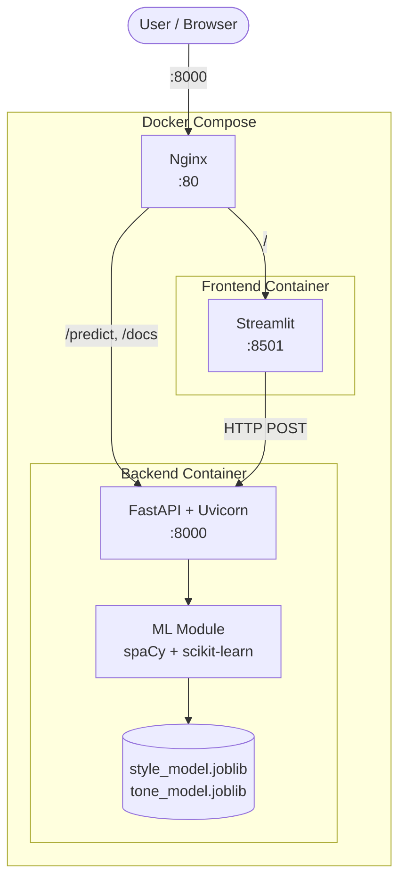
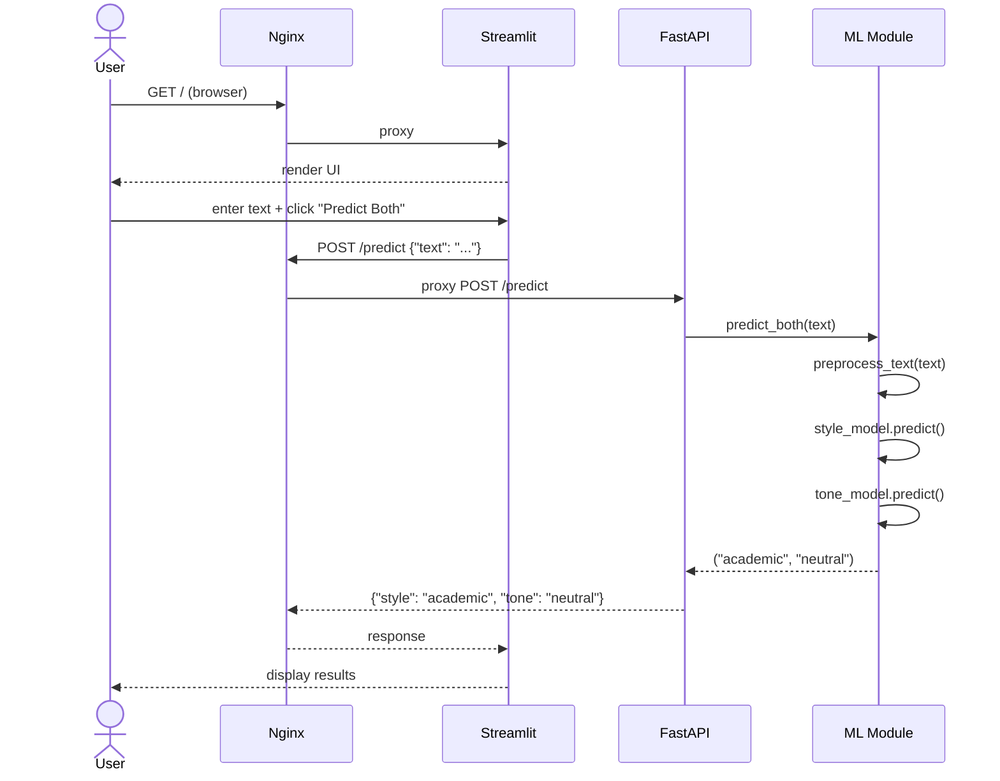

# Application Architecture

The application consists of three containerized services orchestrated by Docker Compose, with Nginx as a reverse proxy.

---

## System Overview



---

## Services

### Backend (FastAPI)

The backend is a **FastAPI** application serving predictions via REST endpoints.

| Property | Value |
|----------|-------|
| Framework | FastAPI |
| Server | Uvicorn |
| Port | 8000 (internal) |
| Base image | `python:3.13-slim-trixie` |

**Lifecycle:**

1. On startup, the `lifespan` context manager loads spaCy and both joblib models into memory
2. Each request preprocesses the input text (lemmatization via spaCy) and runs model inference
3. On shutdown, models are cleared from memory

**Key files:**

| File | Responsibility |
|------|---------------|
| `app/main.py` | FastAPI app, route definitions, lifespan management |
| `app/ml.py` | Model loading, text preprocessing, prediction functions |
| `app/schemas.py` | Pydantic models for request/response validation |

### Frontend (Streamlit)

The frontend is a **Streamlit** application providing an interactive web UI.

| Property | Value |
|----------|-------|
| Framework | Streamlit |
| Port | 8501 (internal) |
| Base image | `python:3.13-alpine3.23` |

Features:

- Text area for user input
- Three action buttons: "Predict Both", "Style Only", "Tone Only"
- Communicates with the backend via HTTP POST requests
- Backend URL configurable via `API_URL` environment variable

### Nginx (Reverse Proxy)

Nginx routes external traffic to the appropriate internal service.

| Property | Value |
|----------|-------|
| Image | `nginx:1.31-alpine3.23` |
| External port | 8000 |
| Internal port | 80 |

**Routing rules:**

| Path | Proxied To | Service |
|------|-----------|---------|
| `/predict` | `http://backend:8000/predict` | FastAPI |
| `/docs` | `http://backend:8000/docs` | FastAPI (Swagger UI) |
| `/openapi.json` | `http://backend:8000/openapi.json` | FastAPI (OpenAPI schema) |
| `/` (everything else) | `http://frontend:8501` | Streamlit |

WebSocket upgrade headers are configured for the Streamlit proxy to support its real-time communication:

```nginx
proxy_http_version 1.1;
proxy_set_header Upgrade $http_upgrade;
proxy_set_header Connection "upgrade";
```

---

## Docker Configuration

### docker-compose.yml

```yaml
services:
  backend:
    build:
      context: .
      dockerfile: backend.Dockerfile
    networks:
      - style-tone-classification

  frontend:
    build:
      context: .
      dockerfile: frontend.Dockerfile
    environment:
      - API_URL=http://backend:8000
    networks:
      - style-tone-classification

  nginx:
    image: nginx:1.31-alpine3.23
    ports:
      - "8000:80"
    volumes:
      - ./nginx/nginx.conf:/etc/nginx/nginx.conf:ro
    depends_on:
      - backend
      - frontend
    networks:
      - style-tone-classification

networks:
  style-tone-classification:
```

### Network

All services communicate over a dedicated Docker network (`style-tone-classification`). Only Nginx exposes a port to the host (`8000:80`).

### Backend Dockerfile

```dockerfile
FROM python:3.13-slim-trixie

WORKDIR /app

RUN pip install --no-cache-dir fastapi joblib uvicorn scikit-learn spacy

COPY app .
COPY saving ./saving

EXPOSE 8000

ENTRYPOINT ["uvicorn", "main:app", "--host", "0.0.0.0", "--port", "8000"]
```

!!! note
    The spaCy `en_core_web_sm` model is downloaded automatically at startup by the `load_models()` function in `ml.py` if it is not already available.

### Frontend Dockerfile

```dockerfile
FROM python:3.13-alpine3.23

WORKDIR /frontend

RUN pip install --no-cache-dir streamlit

COPY frontend .

EXPOSE 8501

ENTRYPOINT ["streamlit", "run", "app.py", "--server.address=0.0.0.0"]
```

---

## Request Flow

A typical prediction request flows through the system as follows:


