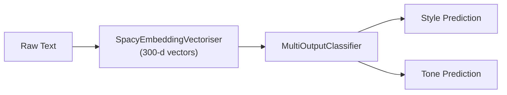

# Approach 2 — spaCy Embeddings + MultiOutputClassifier

> 📓 **Notebook:** `embedding_models_03.ipynb`

This approach replaces sparse TF-IDF vectors with dense pre-trained word embeddings and uses a `MultiOutputClassifier` to predict **both** style and tone simultaneously.

---

## Overview



Key differences from Approach 1:

| Aspect | Approach 1 (TF-IDF) | Approach 2 (Embeddings) |
|--------|---------------------|------------------------|
| Feature type | Sparse (high-dimensional) | Dense (300-d) |
| Feature source | Learned from training data | Pre-trained (spaCy) |
| Input text | `clean_text` (preprocessed) | `text` (raw) |
| Targets | Two independent models | Single multi-output model |
| Vocabulary | Limited by `max_features` | Full spaCy vocabulary |

---

## Feature Extraction — spaCy Word Embeddings

### Embedding Model

This approach uses **spaCy `en_core_web_md`** which provides 300-dimensional GloVe word vectors for ~20k vocabulary words.

### Custom Transformer — SpacyEmbeddingVectoriser

A custom scikit-learn transformer converts text to document-level embedding vectors:

```python
class SpacyEmbeddingVectoriser(BaseEstimator, TransformerMixin):
    """
    Converts text strings into a 2-D numpy array
    of shape (n_samples, vector_size) using spaCy vectors.
    """

    def __init__(self, nlp=None):
        self.nlp = nlp

    def fit(self, X, y=None):
        return self

    def transform(self, X):
        return np.array([self.nlp(text).vector for text in X])
```

The document vector is computed as the **mean of all token vectors** in the document — this is spaCy's default behavior when accessing `doc.vector`.

$$\mathbf{v}_{\text{doc}} = \frac{1}{n} \sum_{i=1}^{n} \mathbf{v}_{w_i}$$

Where $\mathbf{v}_{w_i}$ is the 300-d vector of the $i$-th token.

---

## Label Encoding

Since `MultiOutputClassifier` requires numerical targets, labels are encoded:

```python
le_style = LabelEncoder()  # academic=0, business=1, formal=2, informal=3, literary=4
le_tone  = LabelEncoder()  # aggressive=0, friendly=1, neutral=2, sarcastic=3, urgent=4
```

---

## Models Compared

### Model 1 — SVM (RBF Kernel)

```python
SVC(
    kernel="rbf",
    C=10,
    gamma="scale",
    class_weight="balanced",
    random_state=42
)
```

| Parameter | Value | Rationale |
|-----------|-------|-----------|
| `kernel` | `rbf` | Non-linear decision boundary for dense embeddings |
| `C` | 10 | Moderate regularization |
| `gamma` | `scale` | $\gamma = \frac{1}{n\_features \times \text{Var}(X)}$ |
| `class_weight` | `balanced` | Adjusts for any minor class imbalance |

### Model 2 — Random Forest

```python
RandomForestClassifier(
    n_estimators=300,
    max_depth=None,
    class_weight="balanced",
    random_state=42,
    n_jobs=-1
)
```

| Parameter | Value | Rationale |
|-----------|-------|-----------|
| `n_estimators` | 300 | Sufficient ensemble size for stable predictions |
| `max_depth` | None | Trees grow to full depth |
| `class_weight` | `balanced` | Class-weighted splitting |

Both are wrapped in a `MultiOutputClassifier`:

```python
multi_model = MultiOutputClassifier(base_estimator, n_jobs=-1)
multi_model.fit(X_train_vec, y_train)  # y_train: (n_samples, 2)
```

---

## Cross-Validation

5-fold **stratified** cross-validation (stratified on each target independently):

```python
cv = StratifiedKFold(n_splits=5, shuffle=True, random_state=42)
```

Scoring metric: **F1-macro** (unweighted mean of per-class F1).

---

## Results

### Test Set Performance

| Model | Target | Accuracy |
|-------|--------|----------|
| **SVM** | Style | 0.870 |
| **SVM** | Tone | 0.890 |
| RF | Style | 0.855 |
| RF | Tone | 0.880 |

### Cross-Validation F1-macro

| Model | Target | CV F1-macro |
|-------|--------|-------------|
| **SVM** | Style | 0.853 ± 0.022 |
| **SVM** | Tone | 0.872 ± 0.016 |
| RF | Style | 0.837 ± 0.019 |
| RF | Tone | 0.846 ± 0.013 |

### Per-Class Metrics — SVM (Style)

| Class | Precision | Recall | F1-score | Support |
|-------|-----------|--------|----------|---------|
| academic | 0.95 | 0.88 | 0.91 | 40 |
| business | 0.78 | 0.80 | 0.79 | 40 |
| formal | 0.82 | 0.82 | 0.82 | 40 |
| informal | 0.83 | 0.95 | 0.88 | 40 |
| literary | 1.00 | 0.90 | 0.95 | 40 |

### Per-Class Metrics — SVM (Tone)

| Class | Precision | Recall | F1-score | Support |
|-------|-----------|--------|----------|---------|
| aggressive | 0.95 | 0.88 | 0.91 | 40 |
| friendly | 0.88 | 0.88 | 0.88 | 40 |
| neutral | 0.85 | 0.90 | 0.87 | 40 |
| sarcastic | 0.85 | 0.88 | 0.86 | 40 |
| urgent | 0.93 | 0.93 | 0.93 | 40 |

!!! note "SVM vs Random Forest"
    SVM with RBF kernel consistently outperforms Random Forest on both targets. This is expected for moderate-dimensional dense features (300-d), where SVMs excel at finding optimal decision boundaries.

---

## End-to-End Pipeline

The winning SVM model is packaged as a single scikit-learn `Pipeline` for deployment:

```python
best_pipeline = Pipeline([
    ("embed", SpacyEmbeddingVectoriser(nlp=nlp)),
    ("clf", MultiOutputClassifier(
        SVC(kernel="rbf", C=10, gamma="scale",
            class_weight="balanced", random_state=42),
        n_jobs=-1
    ))
])
```

### Saved Artifacts

| File | Description |
|------|-------------|
| `data/embedding_multioutput_pipeline.joblib` | Full pipeline (vectoriser + classifier) |
| `data/label_encoders.joblib` | Label encoders for both targets |

!!! warning "Large File"
    The embedding pipeline file is ~62 MB due to the spaCy model reference. It is excluded from git via `.gitignore`.
