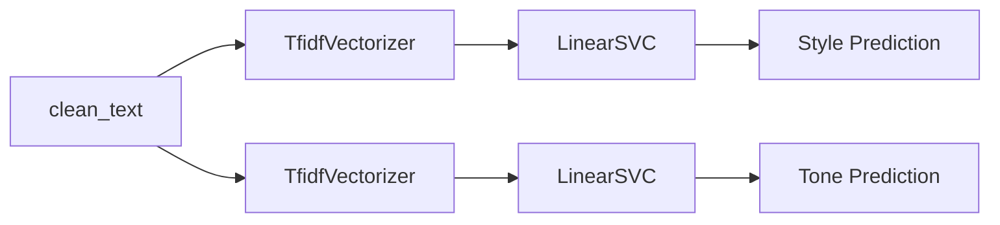

# Approach 1 — TF-IDF + LinearSVC

> 📓 **Notebook:** `modelling_02.ipynb`

This approach trains two independent classifiers — one for **style** and one for **tone** — using sparse TF-IDF features and a linear SVM.

---

## Overview



Each target (style, tone) has its own independent pipeline consisting of a `TfidfVectorizer` and a `LinearSVC`, wrapped in a scikit-learn `Pipeline`:

```python
pipeline = Pipeline([
    ("tfidf", TfidfVectorizer()),
    ("classifier", LinearSVC())
])
```

---

## Feature Extraction — TF-IDF

**TF-IDF** (Term Frequency–Inverse Document Frequency) converts text into a sparse numerical vector where each dimension corresponds to a term (or n-gram) from the vocabulary.

$$\text{TF-IDF}(t, d) = \text{TF}(t, d) \times \log\frac{N}{\text{DF}(t)}$$

Where:

- $\text{TF}(t, d)$ — frequency of term $t$ in document $d$
- $N$ — total number of documents
- $\text{DF}(t)$ — number of documents containing term $t$

Key parameters tuned:

| Parameter | Description | Search Space |
|-----------|-------------|-------------|
| `max_features` | Maximum vocabulary size | {3 000, 5 000} |
| `ngram_range` | Range of n-grams to extract | {(1,1), (1,2), (1,3)} |

---

## Classifier — LinearSVC

**LinearSVC** (Linear Support Vector Classification) is a fast, scalable implementation of SVM for linear kernels. It finds a hyperplane that maximizes the margin between classes in the TF-IDF feature space.

Key parameter tuned:

| Parameter | Description | Search Space |
|-----------|-------------|-------------|
| `C` | Regularization parameter (inverse of regularization strength) | {0.1, 1, 10} |

A smaller `C` encourages a wider margin (more regularization), while a larger `C` allows the model to fit the training data more closely.

---

## Hyperparameter Tuning

Both models are tuned independently using `GridSearchCV`:

```python
grid = GridSearchCV(
    estimator=pipeline,
    param_grid={
        "tfidf__max_features": [3000, 5000],
        "tfidf__ngram_range": [(1, 1), (1, 2), (1, 3)],
        "classifier__C": [0.1, 1, 10],
    },
    scoring="f1_weighted",
    cv=5,
    n_jobs=-1,
)
```

| Setting | Value |
|---------|-------|
| Total configurations | 2 × 3 × 3 = **18** |
| Cross-validation folds | 5 |
| Total fits per model | 90 |
| Scoring metric | F1 (weighted) |

---

## Data Split

```python
X_train, X_test, y_train, y_test = train_test_split(
    X, y, test_size=0.2, random_state=42, stratify=y
)
```

| Set | Size | Share |
|-----|------|-------|
| Training | 800 | 80% |
| Test | 200 | 20% |

Stratified splitting ensures that class proportions are preserved in both sets.

---

## Best Hyperparameters

### Style Model

| Parameter | Best Value |
|-----------|-----------|
| `tfidf__max_features` | 5 000 |
| `tfidf__ngram_range` | (1, 3) |
| `classifier__C` | 1 |

### Tone Model

| Parameter | Best Value |
|-----------|-----------|
| `tfidf__max_features` | 5 000 |
| `tfidf__ngram_range` | (1, 2) |
| `classifier__C` | 1 |

!!! note "Observation"
    Both models selected `max_features=5000` and `C=1`. The style model benefits from trigrams `(1,3)`, suggesting that longer phrases carry more stylistic information, while bigrams `(1,2)` suffice for tone.

---

## Results

### Style Classification

| Metric | Value |
|--------|-------|
| **CV F1 (weighted)** | 0.918 |
| **Test F1 (weighted)** | 0.886 |
| **Test Accuracy** | 0.89 |

| Class | Precision | Recall | F1-score | Support |
|-------|-----------|--------|----------|---------|
| academic | 0.97 | 0.93 | 0.95 | 40 |
| business | 0.71 | 0.85 | 0.77 | 40 |
| formal | 0.88 | 0.72 | 0.79 | 40 |
| informal | 0.90 | 0.95 | 0.93 | 40 |
| literary | 1.00 | 0.97 | 0.99 | 40 |

!!! info "Analysis"
    - **Literary** is the easiest class to detect (F1 = 0.99), likely due to its distinctive figurative language.
    - **Business** and **formal** are the hardest to separate (F1 = 0.77 and 0.79), as they share similar vocabulary and sentence structures.

### Tone Classification

| Metric | Value |
|--------|-------|
| **CV F1 (weighted)** | 0.950 |
| **Test F1 (weighted)** | 0.935 |
| **Test Accuracy** | 0.94 |

| Class | Precision | Recall | F1-score | Support |
|-------|-----------|--------|----------|---------|
| aggressive | 1.00 | 0.90 | 0.95 | 40 |
| friendly | 0.93 | 0.93 | 0.93 | 40 |
| neutral | 0.91 | 0.97 | 0.94 | 40 |
| sarcastic | 0.88 | 0.93 | 0.90 | 40 |
| urgent | 0.97 | 0.95 | 0.96 | 40 |

!!! info "Analysis"
    - Tone classification outperforms style classification overall (F1 = 0.935 vs 0.886).
    - **Sarcastic** is the most challenging tone (F1 = 0.90), which is expected — sarcasm is notoriously difficult even for humans.

---

## Model Artifacts

The trained models are saved as joblib files:

```
saving/
├── style_model.joblib    # Pipeline: TfidfVectorizer + LinearSVC (style)
└── tone_model.joblib     # Pipeline: TfidfVectorizer + LinearSVC (tone)
```

Each file contains a complete scikit-learn `Pipeline` that can be loaded and used directly for inference:

```python
import joblib

model = joblib.load("saving/style_model.joblib")
prediction = model.predict(["your preprocessed text here"])
```

!!! warning "Not committed to git"
    The `.joblib` model files are excluded from version control via `.gitignore`. To obtain them, run the `modelling_02.ipynb` notebook.
